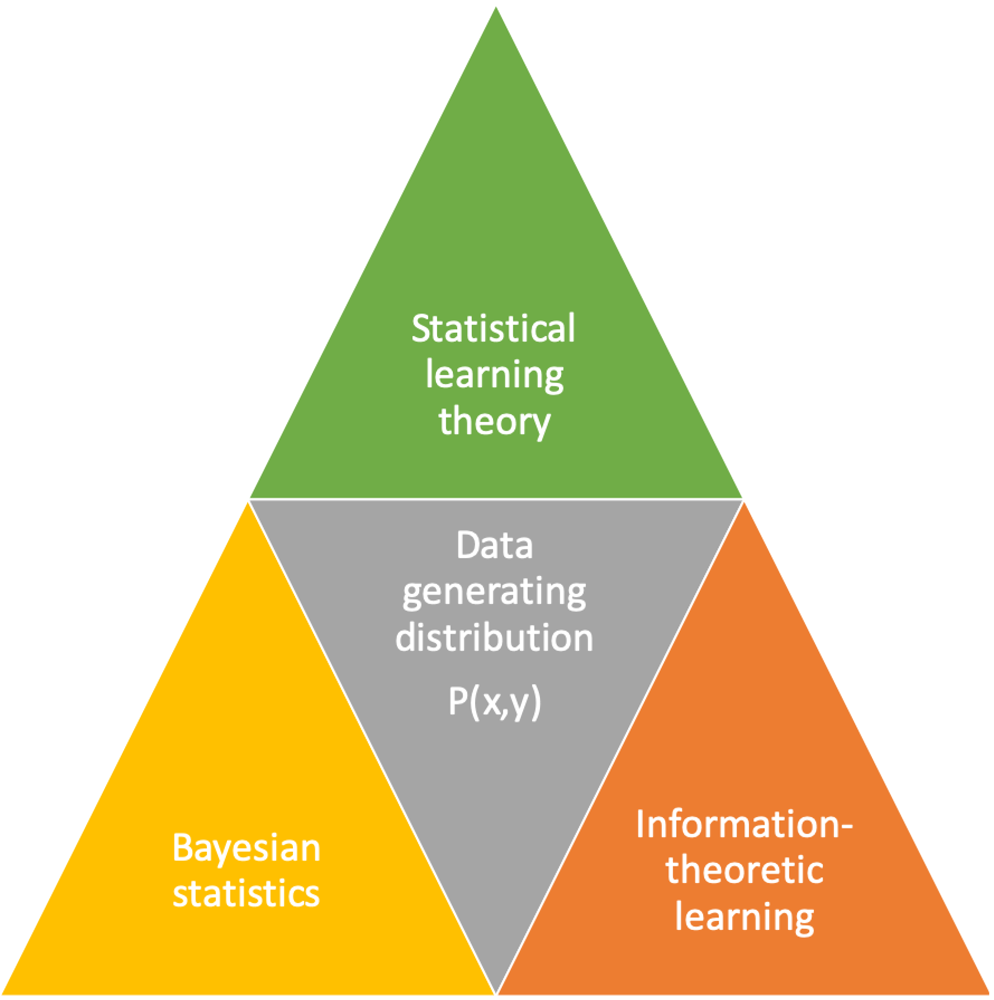

# Machine Learning: Supervised Methods NOTES

---

Table of content

# Table of content

## [PART I – Theory](#PartI)

### 1. [Introduction](#1)

#### &nbsp;&nbsp;&nbsp;&nbsp;&nbsp; 1.1 [Theoretical paradigms](#1.1)

#### &nbsp;&nbsp;&nbsp;&nbsp;&nbsp; 1.2 [Dimensions of a supervised learning algorithm](#1.2)

#### &nbsp;&nbsp;&nbsp;&nbsp;&nbsp; 1.3 [Classification (Task 1/3)](#1.3)

##### &nbsp;&nbsp;&nbsp;&nbsp;&nbsp;&nbsp;&nbsp;&nbsp;&nbsp;&nbsp;&nbsp;&nbsp;&nbsp;&nbsp; 1.3.1 [Version space](#1.3.1)

#### &nbsp;&nbsp;&nbsp;&nbsp;&nbsp; 1.4 [Regression (Task 2/3)](#1.4)

#### &nbsp;&nbsp;&nbsp;&nbsp;&nbsp; 1.5 [Ranking & preference learning (Task 3/3)](#1.5)

#### &nbsp;&nbsp;&nbsp;&nbsp;&nbsp; 1.6 [Generalization](#1.6)

##### &nbsp;&nbsp;&nbsp;&nbsp;&nbsp;&nbsp;&nbsp;&nbsp;&nbsp;&nbsp;&nbsp;&nbsp;&nbsp;&nbsp; 1.6.1 [Model evaluation by testing](#1.6.1)

### 2. [Statistical Learning Theory](#2)

---

 
 
 
 

# PART 1 – Theory 

---

 

# Lecture 1: Introduction 

## 1.1 Theoretical paradigms 

Theoretical paradigms for machine learning **differ** mainly on what they <u>assume about the process generating the data</u>:

  

* **Statistical learning theory (focus on this course):** assumes data is <u>i.i.d</u> from an <u>unknown distribution P(x)</u>, does not estimate the distribution (directly)

* **Bayesian Statistics:** assumes <u>prior information on P(x)</u>, estimates posterior probabilities

* **Information theoretic learning (e.g. Minimum Description Length principle, MDL):** estimates distributions, but does not assume a prior on P(x)

 
 

## 1.2 Dimensions of a supervised learning algorithm 

1. **Training sample:** $S = \{(x_i, y_i)\}^m_{i=1}$ the training examples $(x, y) ∈ X × Y$ independently drawn from a identical distribution $(i.i.d) D$ defined on $X × Y, X$ is a space of inputs, $Y$ is the space of outputs.

2. **Model or hypothesis:** $h : X → Y$ that we use to predict outputs
given the inputs $x$.

3. **Loss function:** $L : Y × Y → \R, L(...) ≥ 0, L(y, y')$ is the loss incurred when predicting $y'$ when $y$ is true.

4. **Optimization** procedure to find the hypothesis $h$ that minimize the loss on the training sample.

 
 

## 1.3 Classification (Task 1/3) 

**Problem:** partitioning the data into pre-defined classes by a *decision boundary* or *decision surface*.

**Multi-class classification:** more than two classes
* **Multi-label Classification:** An example can belong to multiple classes at the same time
* **Extreme classification:** Learning with thousands to hundreds of thousands of classes (Prof. Rohit Babbar @ Aalto)

$$
x_2 + 1
$$

### 1.3.1 Version space 

And

**
$$
$$a_2$$
$$
**Version space:** the set of <u>all consistent hypotheses</u> of the hypothesis class

* **Consistent hypothesis:** if <u>correctly classifies all training examples</u>

* **In version space:**
    * **Most general hypothesis $G$:** <u>cannot be expanded</u> without including negative training examples
    * **Most specific hypothesis $S$:** <u>cannot be made smaller</u> without excluding positive training points

  

  * Intuitively, the **”safest” hypothesis** to choose from the version space is the one that is furthers from the positive and negative training examples $\rightarrow$ <u>maximum margin</u>
      * Margin = minimum distance between the decision boundary and a training point

 
 

## 1.4 Regression (Task 2/3) 

**Problem:** output variables which are numeric.

 
 

## 1.5 Ranking & preference learning (Task 3/3) 

**Problem:** predict a ordered list of preferred objects.

**Training data (typically):** pairwise preferences.
* e.g. user $x$ prefers movie $y_i$ over movie $y_j$

**Output:** an ranked list of elements.

 
 

## 1.6 Generalization 

**Aim:** <u>predict as well as possible the outputs of future examples</u>, not only for training sample.

We would like to *minimize* the **generalization error**, or the **(true) risk**:

$$R(h) = E_{(x,y) \sim D}[L(h(x), y)]$$

  Where:

* **distribution $D$**
    * Assuming future examples are independently drawn from the same distribution $D$ that generated the training examples (<u>i.i.d assumption</u>)
    * We <u>don't know $D$</u>!

 

What can we say about $R(h)$ based on training examples and the hypothesis class H alone? Two possibilities:
* [Empirical evaluation by testing](#1.6.1)
* Statistical learning theory ([Section 2](#2) and 3)

### 1.6.1 Model evaluation by testing 

**What:** estimate the model’s ability to generalize on future data

**How:** <u>approximating true risk</u> **by** computing the <u>empirical risk on a independent test sample</u>:

$$R_{test}(h) = \sum_{(x_i,y_i) \in S_{test}}^{m} L(h(x_i),y_i)$$

• The <u>expectation of $R_{test}(h)$</u> is the <u>true risk $R(h)$</u>

 
 

## 1.7 Hypothesis classes 

There is a huge number of different **hypothesis classes** or **model families** in machine learning, **e.g:**

* **Linear models** such as logistic regression and perceptron
* **Neural networks:** compute non-linear input-output mappings through a network of simple computation units
* **Kernel methods:** implicitly compute non-linear mappings into
high-dimensional feature spaces (e.g. SVMs)
* **Ensemble methods:** combine simpler models into powerful combined models (e.g. Random Forests)

Each have their <u>different pros and cons in different dimensions (accuracy, efficiency, interpretability)</u>; No single best hypothesis class exists that would be superior to all others in all circumstances

---

 

# Lecture 2: Statistical Learning Theory 

**What:** Theoretical background on machine learning.

**Goal:** [Generalization](#1.6).

 
 

## 2.1 Probably Approximately Correct (PAC) learning 

**What:** *Theoretical framework* that <u>formalizes the notion of generalization</u> in machine learning.

**Ingredients:**
* **input space $X$** containing all possible **inputs $x$**
* set of possible **labels $Y$** $($in binary classification $Y = \{0, 1\}$$)$

**Goal:** to learn a <u>hypothesis with a low generalization error</u>

$$R(h) = E_{x \sim D} [L_{0/1}(h(x), C(x))] = Pr_{x \sim D} (h(x) \neq C(x))$$
